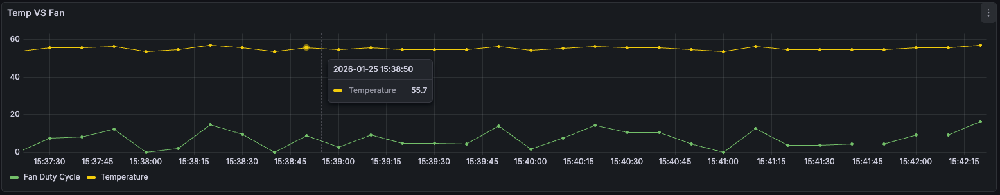

# NanoCtl

**NanoCtl** is a CLI tool and daemon for managing **Nano Cluster** nodes (CM5). It handles power management via GPIO and intelligent fan control using PID algorithms.



## Features

*   **Power Management**: Power On, Graceful Shutdown, Force Off, and Reset for CM5 nodes.
*   **Smart Fan Control**: PID-based PWM fan control to maintain target temperatures.
*   **Metrics**: Push fan & temp metrics to Prometheus/OpenTelemetry (OTLP) with Basic Auth support.
*   **Cluster Aware**: Can read temperatures from a Prometheus server to control fans based on cluster-wide metrics.
*   **Native**: Written in Go, single binary, no external runtime dependencies.

## 🚀 Quick Install

Run this command on your Raspberry Pi/CM5 to install NanoCtl and enable the fan service automatically:

```bash
curl -fsSL https://raw.githubusercontent.com/AlejandroPerez92/nanoctl/main/install.sh | sudo bash
```

## 📖 Documentation

*   **[Installation Guide](doc/installation.md)** - Manual installation & building from source.
*   **[Configuration Guide](doc/configuration.md)** - `fan.yaml` options, GPIO, and PID tuning.
*   **[Metrics & Prometheus](doc/metrics.md)** - Setting up OTLP push and Prometheus pull.
*   **[Command Reference](doc/commands.md)** - List of all CLI commands.

## 🛠 Basic Usage

**Power Control:**
```bash
sudo nanoctl poweron 2    # Power on slot 2
sudo nanoctl poweroff 2   # Graceful shutdown slot 2
sudo nanoctl reset 2      # Reset slot 2
```

**Service Management:**
```bash
sudo systemctl status nanoctl-fan  # Check fan status
sudo journalctl -u nanoctl-fan -f  # View logs
```

## Hardware PWM (CM5)

NanoCtl supports hardware PWM via sysfs for CM5 fan control, including inverted PWM (high=0%, low=100%).

### 1) Enable PWM overlays (Raspberry Pi Debian OS)

Edit the boot config file and add the overlays below:

```bash
sudo nano /boot/firmware/config.txt
```

Add:

```ini
dtoverlay=dwc2,dr_mode=host
dtoverlay=pwm-2chan,pin=12,func=4,pin2=13,func2=4
```

Reboot after saving.

### 2) Configure NanoCtl for hardware PWM

Use this `fan.yaml` snippet:

```yaml
pwm:
  mode: "hardware"
  frequency_khz: 25
  hardware:
    chip: "pwmchip0"
    channel: 1
    inverted: true
```

Notes:
- `frequency_khz` defaults to 25 if omitted.
- `inverted: true` maps high=0% and low=100% for inverted fans.
- `channel: 1` corresponds to `/sys/class/pwm/pwmchip0/pwm1`.

## Hardware References

This tool is designed for the Sipeed Nano Cluster hardware.

*   **Manufacturer**: [Sipeed](https://sipeed.com)
*   **Hardware Wiki**: [Nano Cluster Wiki](https://wiki.sipeed.com/hardware/en/cluster/NanoCluster/index.html)

## License

MIT
